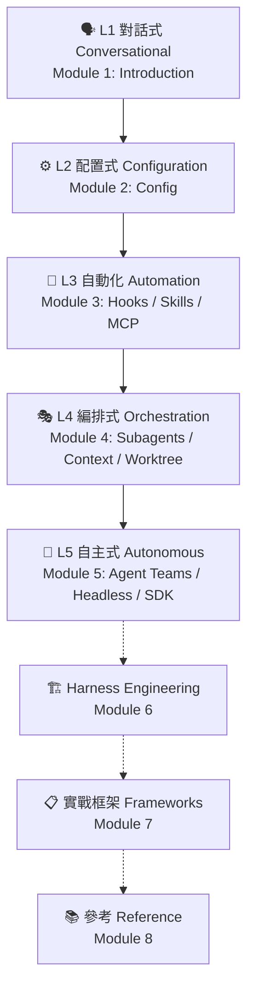

# Claude Code Mastery

> 從入門到精通的完整教學講義 | Complete mastery guide from beginner to expert

<!-- TODO: 補上終端操作 GIF 示範（錄製 Hook 觸發或 Agent 並行畫面）

-->

---

## Choose Language | 選擇語言

| 語言 Language | 入口 Entry |
|---------------|-----------|
| 繁體中文 | [開始閱讀 →](zh/00-索引與摘要.md) |
| English | [Start Reading →](en/00-index.md) |

---

## Course Structure | 課程結構

Built on David Chu's Five-Layer Evolution Model | 以 David Chu 五層進化模型為骨架

| Module 模組 | Topic 主題 | Chapters 章數 |
|-------------|-----------|--------------|
| 1 | Introduction 認識 Claude Code | 2 |
| 2 | Configuration 基礎配置 | 3 |
| 3 | Automation 自動化 | 4 |
| 4 | Orchestration 編排 | 3 |
| 5 | Autonomous 自主 | 3 |
| 6 | Harness Engineering | 2 |
| 7 | Real-World Frameworks 實戰框架 | 4 |
| 8 | Reference 參考資源 | 3 |

**Total 共計: 8 modules 模組, 24 chapters 章**

---

## Prerequisites | 先備技能

| Level 級別 | Background 需要的背景 | Modules 涵蓋模組 |
|-----------|----------------------|-----------------|
| Basic 基礎 | Terminal basics (cd, ls), Git fundamentals (clone, commit, push) | Module 1-2 |
| Intermediate 進階 | Node.js 18.x + TypeScript basics, npm | Module 3-5 hands-on |
| Advanced 專家 | CI/CD concepts (GitHub Actions), collaborative Git workflows | Module 5-7 |

No prior Claude Code or AI tool experience needed — Module 1 starts from zero.
不需要事先了解 Claude Code 或 AI 工具——模組 1 從零開始。

---

## Case Project | 主案例專案

**AI Dev Assistant** — Node.js 18.x / TypeScript 5.x / Jest 29.x / ESLint 8.x

See [PROJECT_SPEC.md](PROJECT_SPEC.md) for details.

---

## Feedback & Contributing | 回饋與貢獻

- Found an error or have a suggestion? Open a [GitHub Issue](https://github.com/Stanshy/claude-code-mastery/issues)
- Pull requests for corrections or additional content are welcome
- 發現錯誤或有建議？歡迎在 [GitHub Issues](https://github.com/Stanshy/claude-code-mastery/issues) 提出
- 歡迎透過 Pull Request 貢獻內容

---

Stanshy | 2026
